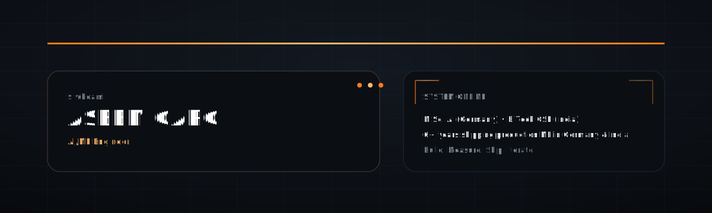
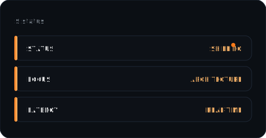

<!--
Black / Orange / Ultra-modern profile repo.
Design strategy:
- Local SVG assets for reliability (no flaky external cards).
- Optional external typing SVG (stable, but removable).
- GitHub-safe HTML only, no inline CSS.
-->

<div align="center">
  
</div>

<div align="center">
  <a href="#">
    
  </a>
</div>

<div align="center">
  
</div>

<table>
  <tr>
    <td width="58%" valign="top">

## `$ aboutme`
```js
const aseem = {
  role: "AI/ML Engineer",
  experience: "6+ years",
  education: ["M.Sc. AI (Germany)", "B.Tech CSE (India)"],
  footprint: ["Germany", "India"],
  build_mode: "production-first",
  motto: "If it doesn’t ship, it's just a Jupyter notebook."
};
```

### What I actually do
  - Architecting 'Zero-Touch' probabilistic decision engines.
  - Translating SOTA papers into reproducible production systems.
  - Accelerating training loops via Multi-GPU & Mixed Precision.
  - Building high-throughput Feature Stores for real-time scoring.

    </td>
    <td width="42%" valign="default">

<div align="center">

  
  <br/><br/>
  
</div>

    
  </tr>
</table>

---

<div align="center">
  
</div>


<br />

<div align="center">
  
</div>


<br />

## 🚀 Tech Stack & Tooling

<table>
  <tr>
    <td valign="top" width="33%">

### 🧠 AI Agents & GenAI
- LangChain, LangGraph, Agentic Systems
- RAG Pipelines, Llama-3, Prompt Engineering
- Vector DBs: Pinecone, Milvus, Weaviate

### 🔥 Machine Learning
- PyTorch, TensorFlow, Distributed Training (DDP)
- Scikit-learn, XGBoost, LightGBM
- Hugging Face Transformers

    </td>
    <td valign="top" width="33%">

### 🏗 Backend & Infrastructure
- Python (Pydantic), FastAPI
- Docker, Kubernetes, Terraform
- AWS: EKS, Lambda, S3

### 📊 Data Engineering
- Apache Spark, PySpark
- Event-Driven Architecture, SQL
- Palantir Foundry

    </td>
    <td valign="top" width="33%">

### 📈 Analytics & Experimentation
- Tableau, PowerBI, Looker
- A/B Testing, Hypothesis Testing, Statistical Inference

### ⚙ Core Competencies
- System Design
- MLOps (CI/CD for ML)
- Algorithm Optimization
- Technical Leadership

    </td>
  </tr>
</table>


## Focus Areas
<table>
  <tr>
    <td width="33%" valign="top">

### 🧠 Deep Learning
- architectures that survive deployment  
- distillation / quantization  
- accuracy ↔ latency tradeoffs

    </td>
    <td width="33%" valign="top">

### 🚀 ML Systems
- inference at scale (online + batch)  
- monitoring, drift, incident-friendly ops  
- reproducible pipelines (CI/CD for ML)

    </td>
    <td width="33%" valign="top">

### ✨ Generative AI
- agentic workflows + RAG pipelines
- synthetic data generation (Diffusion / GANs)
- vector search & LLM orchestration

    </td>
  </tr>
</table>

---

<div align="center">
  
</div>
